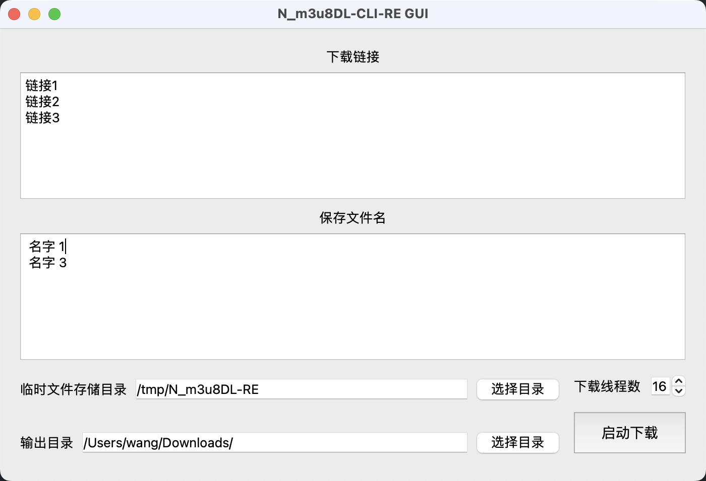

# N_m3u8DL-RE-GUI

> 使用 PySide6 构建的一个 N_m3u8DL-RE 的一个简易跨平台 GUI

## 使用说明

> N_m3u8DL-RE 需要安装 ffmpeg

我仅编译了 macOS(Arm64) 版本的,有需要其他版本的自行编译即可



下载链接和文件名时顺序匹配的,如图

- 链接1 对应 名字1
- 链接2 对应 名字3
- 链接3 就为空,为空的名字会自动设置为 **年月日时分秒**

临时存储目录并不重要,因为下载完毕总会删除分片,如果你想做出其他修改,建议改源码,本程序就是个简单的 GUI

输出目录默认为当前用户下的 Downloads 目录

点击启动下载时,UI 会卡住,因为他不是一个异步程序,所以需要等待下载完毕后程序才能恢复

由于 N_m3u8DL-RE 的返回结果导致,无法判断是否下载失败,所以请自行判断下载结果
下载结束后一律通知下载成功,等待 N_m3u8DL-RE 修复就能恢复了

## 编译说明

编译前请保证依赖完整安装

```sh
pip install -r ./requirements.txt
```

其他版本需要替换 bin/N_m3u8DL-RE 文件,替换为为对应的系统版本,文件名不要变动

```sh
python ./package.py
```

或者直接运行本程序,不需要打包

```sh
python index.py
```

## 引用项目

使用应用图标:

[nilaoda/N_m3u8DL-CLI-SimpleG](https://github.com/nilaoda/N_m3u8DL-CLI-SimpleG)

程序核心执行文件:

[nilaoda/N_m3u8DL-RE](https://github.com/nilaoda/N_m3u8DL-RE)